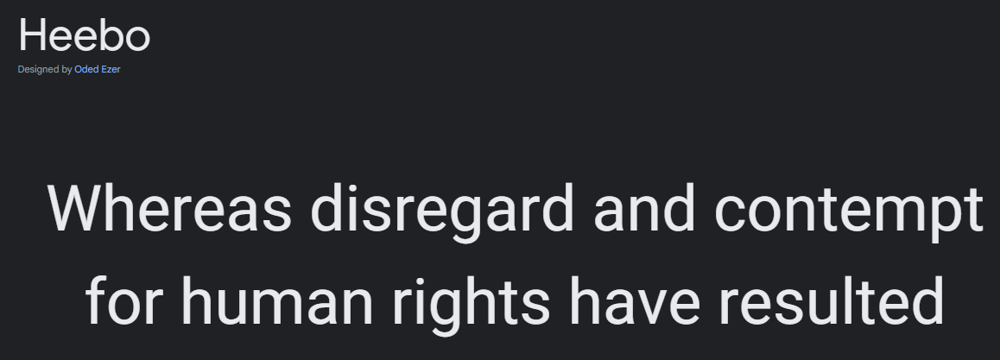
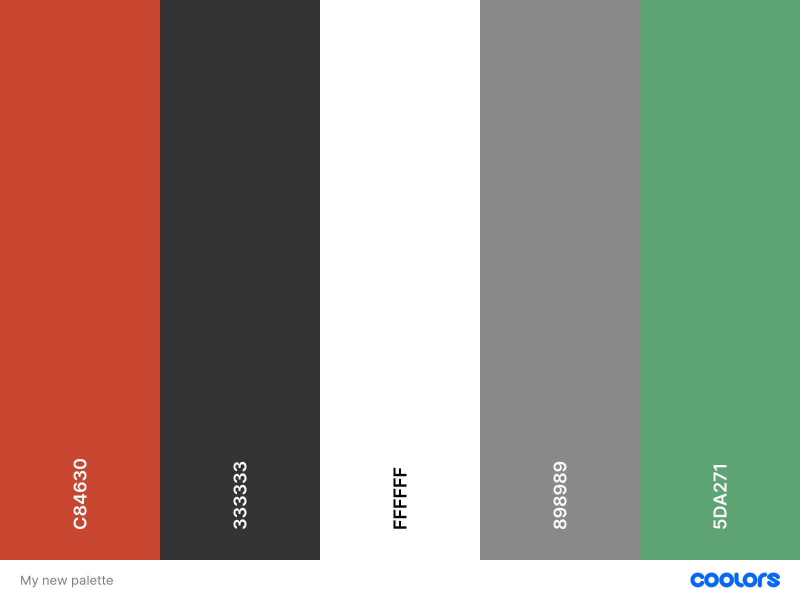
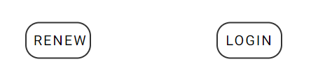
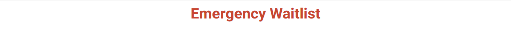
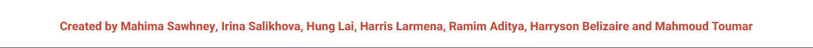

# Hospital Triage App Design

_This file will document the design for the Hospital Triage App System_
<link rel="preconnect" href="https://fonts.googleapis.com">
<link rel="preconnect" href="https://fonts.gstatic.com" crossorigin>
<link href="https://fonts.googleapis.com/css2?family=Heebo:wght@400;500;700&display=swap" rel="stylesheet">

## Fonts and Type Scale 

**{font-family: 'Heebo', sans-serif;}**

| Element name   | Font Features |
| ------------ | ------------ |
|  Header   |   Bold 700, 35px-75px   |
|  Navigation/Menu bar   |  Bold 600, 16px    |
| Footer   |  Bold 500   |
 
## Colour Palette

 

## Icons

## UI components

### Buttons

### Navigation bar

### Header

### Footer

